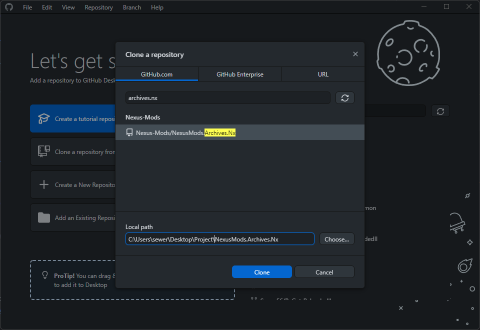
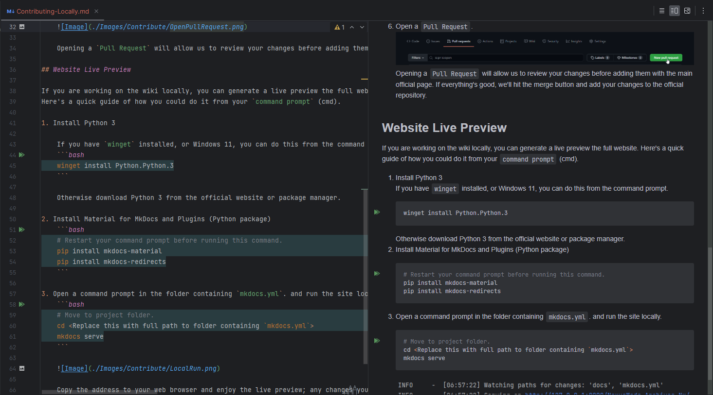

# Contributing to the Wiki: Locally

!!! info

    This page shows you how to contribute to any documentation page or wiki 
    based on this template.

## Tutorial
You should learn the basics of `git`, an easy way is to give [GitHub Desktop (Tutorial)](https://www.youtube.com/watch?v=77W2JSL7-r8) a go.  
It's only 15 minutes 😀.

1. Create a GitHub account.
2. Fork this repository:

    

    This will create a copy of the repository on your own user account, which you will be able to edit.

3. Clone this repository.

    For example, using GitHub Desktop:
    

4. Make changes inside the `docs` folder.

    

    Consider using a [*Markdown Cheat Sheet*](https://github.com/adam-p/markdown-here/wiki/Markdown-Cheatsheet) if you are new to markdown.

    I recommend using a markdown editor such as `Typora`.  
    Personally I just work from inside `Rider`.  

5. Commit the changes and push to GitHub.

6. Open a `Pull Request`.

    

    Opening a `Pull Request` will allow us to review your changes before adding them with the main official page. If everything's good, we'll hit the merge button and add your changes to the official repository.

## Website Live Preview

If you are working on the wiki locally, you can generate a live preview the full website.
Here's a quick guide of how you could do it from your `command prompt` (cmd).

1. Install Python 3

    If you have `winget` installed, or Windows 11, you can do this from the command prompt.

    === "Windows (winget)"

        ```bash
        winget install Python.Python.3
        ```

    === "Archlinux"

        ```
        pacman -S python-pip # you should already have Python
        ```

    Otherwise download Python 3 from the official website or package manager.

2. Install Material for MkDocs and Plugins (Python package)


    === "Windows/OSX"

        ```bash
        # Restart your command prompt before running this command.
        pip install mkdocs-material
        pip install mkdocs-redirects
        ```

    === "Linux"

        On Linux, there is a chance that `python` might be a core part of your OS, meaning
        that you ideally shouldn't touch the system installation.

        Use virtual environments instead.

        ```bash
        python -m venv mkdocs # Create the environment
        source ~/mkdocs/bin/activate # Enter the environment

        pip install mkdocs-material
        pip install mkdocs-redirects
        ```

        Make sure you enter the environment before any time you run mkdocs.

3. Open a command prompt in the folder containing `mkdocs.yml`. and run the site locally.
    ```bash
    # Move to project folder.
    cd <Replace this with full path to folder containing `mkdocs.yml`>
    mkdocs serve
    ```

    

    Copy the address to your web browser and enjoy the live preview; any changes you save will be shown instantly.