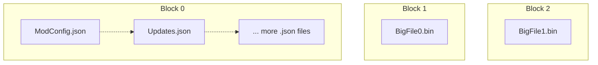
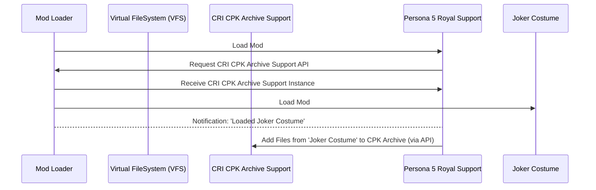
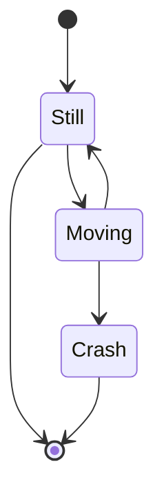
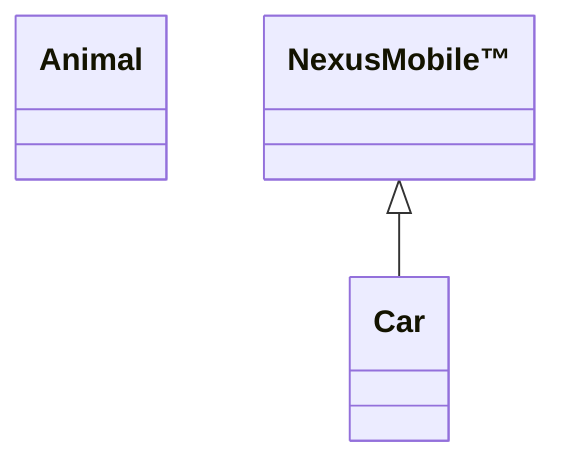

# Testing Zone

!!! info

    This is a dummy page with various Material MkDocs controls and features scattered throughout for testing.

## Custom Admonitions

!!! nexus "[Nexus](https://www.nexusmods.com) Admonition"

    An admonition featuring a Nexus logo.
    My source is in [Stylesheets/extra.css](../Stylesheets/extra.css) as `Custom 'nexus' admonition`.  

!!! nexusheart "Heart Admonition"

    An admonition featuring a heart; because we want to contribute back to the open source community.  
    My source is in [Stylesheets/extra.css](../Stylesheets/extra.css) as `Custom 'nexus heart' admonition`.  

## Mermaid Diagram

Flowchart ([Source: Nexus Archive Library](https://nexus-mods.github.io/NexusMods.Archives.Nx/)):  



Sequence Diagram ([Source: Reloaded3 Specification](https://reloaded-project.github.io/Reloaded-III/Loader/Core-Architecture/#from-perspective-of-layer-2-game-support-mod)):  



State Diagram ([Source: Mermaid Docs](https://mermaid.js.org/syntax/stateDiagram.html)):  



Class Diagram (Arbitrary)



!!! note

    At time of writing, version of Mermaid is a bit outdated here; and other diagrams might not render correctly
    (even on unmodified theme); thus certain diagrams have been omitted from here.

## Code Block

Snippet from C# version of [Sewer's Virtual FileSystem (VFS)](https://github.com/Reloaded-Project/reloaded.universal.redirector/blob/2230cf6c2525209bc23fd9f4b88b80b7f2e37cba/Reloaded.Universal.Redirector.Lib/Structures/LookupTree.cs#L74):

```csharp
/// <summary>
/// Tries to get files for a specific folder, assuming the input path is already in upper case.
/// </summary>
/// <param name="folderPath">The folder to find. Already lowercase.</param>
/// <param name="value">The returned folder instance.</param>
/// <returns>True if found, else false.</returns>
[MethodImpl(MethodImplOptions.AggressiveInlining)]
public bool TryGetFolderUpper(ReadOnlySpan<char> folderPath, out SpanOfCharDict<TTarget> value)
{
    // Must be O(1)
    value = default!;        
    
    // Compare equality.
    // Note to devs: Do not invert branches, we optimise for hot paths here.
    if (folderPath.StartsWith(Prefix))
    {
        // Check for subfolder in branchless way.
        // In CLR, bool is length 1, so conversion to byte should be safe.
        // Even suppose it is not; as long as code is little endian; truncating int/4 bytes to byte still results 
        // in correct answer.
        var hasSubfolder = Prefix.Length != folderPath.Length;
        var hasSubfolderByte = Unsafe.As<bool, byte>(ref hasSubfolder);
        var nextFolder = folderPath.SliceFast(Prefix.Length + hasSubfolderByte);
        
        return SubfolderToFiles.TryGetValue(nextFolder, out value!);
    }
    
    return false;
}
```

Something more number heavy, [Fast Inverse Square Root](https://archive.softwareheritage.org/browse/content/sha1_git:bb0faf6919fc60636b2696f32ec9b3c2adb247fe/?origin_url=https://github.com/id-Software/Quake-III-Arena&path=code/game/q_math.c&revision=dbe4ddb10315479fc00086f08e25d968b4b43c49&snapshot=4ab9bcef131aaf449a7c01370aff8c91dcecbf5f#L549-L572) from Quake III Arena (unmodified).
```c++
float Q_rsqrt( float number )
{
	long i;
	float x2, y;
	const float threehalfs = 1.5F;

	x2 = number * 0.5F;
	y  = number;
	i  = * ( long * ) &y;                       // evil floating point bit level hacking
	i  = 0x5f3759df - ( i >> 1 );               // what the fuck? 
	y  = * ( float * ) &i;
	y  = y * ( threehalfs - ( x2 * y * y ) );   // 1st iteration
//	y  = y * ( threehalfs - ( x2 * y * y ) );   // 2nd iteration, this can be removed

	return y;
}
```

## Default Admonitions

!!! note

    Test

!!! abstract

    Test


!!! info

    Test


!!! tip

    Test

!!! success

    Test

!!! question

    Test

!!! warning

    Test

!!! failure

    Test

!!! danger

    Test

!!! bug

    Test

!!! example

    Test

!!! quote

    Test

## Tables

| Method      | Description                          |
| ----------- | ------------------------------------ |
| `GET`       | :material-check:     Fetch resource  |
| `PUT`       | :material-check-all: Update resource |
| `DELETE`    | :material-close:     Delete resource |